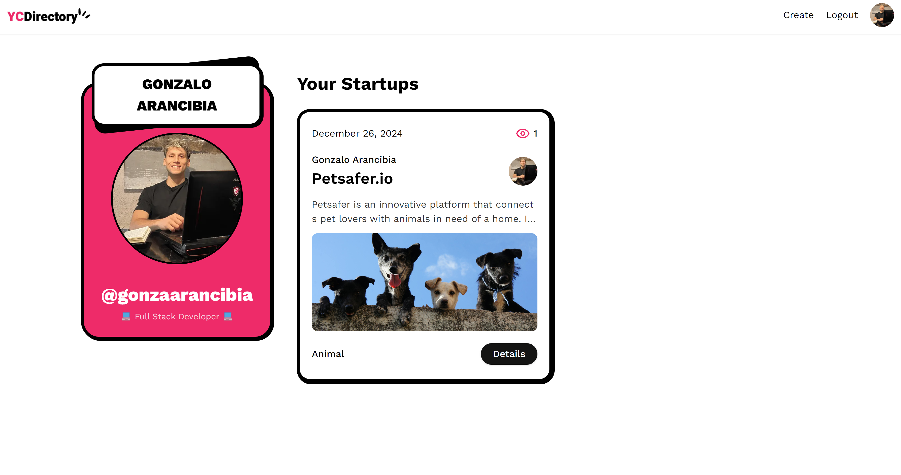
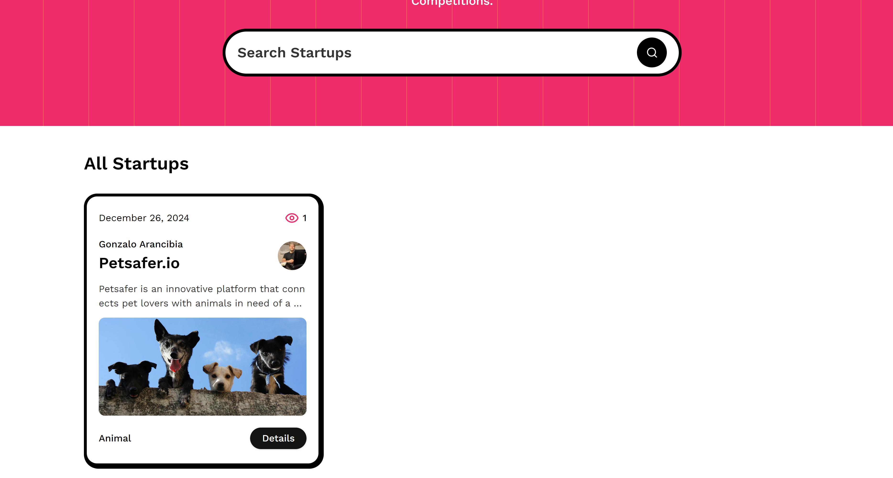

<div align="center">
  <br />
      
  <br />

  <div>
    
    
    
    
    
    
  </div>

<h3 align="center">Startup Directory Platform</h3>

   <div align="center">
     Welcome to my project developed with Next.js 15, created to showcase my advanced web development skills. This platform focuses on exploring startup ideas, combining modern technologies with an emphasis on performance optimization and user experience.
    </div>
</div>

## 📋 <a name="table"> Explore the project</a>

You can view the live project here: https://yc-directory-umber.vercel.app

## 📋 <a name="table">Table of Contents</a>

1. 🤖 [Introduction](#introduction)
2. ⭐ [What makes this project special?](#what-makes-this-project-special?)
3. ⚙️ [Technologies and Tools](#tech-stack)
4. 🔋 [Features](#features)
5. 🤸 [Installation and Local Setup](#quick-start)
6. 🔗 [Assets](#links)
7. 🚀 [Screenshots](#screenshots)

## <a name="introduction">🤖 Introduction</a>

A Next.js 15 platform where entrepreneurs can submit their startup ideas for virtual pitch competitions, browse other
pitches, and gain exposure through a clean minimalistic design for a smooth user experience.

## <a name="what-makes-this-project-special?">⭐ What makes this project special?</a>

This project incorporates a wide range of advanced technical skills to build a robust and scalable application. Here are the main technical features implemented:

- **Next.js 15 App Folder Structure**: Efficiently organized files for seamless development.
- **Client Components vs Server Components**: Strategic usage to balance interactivity and performance.
- **File-based Routing**: Implemented dynamic, nested routes and route groups for modular navigation.
- **Special Files**: Utilized page, layout, loading, and error files for structured development.
- **Serverless Route Handlers**: Integrated API routes and full-stack functionalities for seamless interactions.
- **SEO Optimization**: Dynamic metadata generation and strategies to enhance search engine visibility.
- **Multiple Data Fetching Methods**:
  -Server-Side Rendering (SSR)
  -Static Site Generation (SSG)
  -Incremental Static Generation (ISR)
  -Partial Pre-rendering (PPR)
- **Caching and Performance**: Leveraged Next.js cache and server actions for optimal performance.
- **Parallel and Sequential Data Fetching**: Enhanced efficiency with modern data fetching techniques.
- **Authentication with NextAuth**: Secure and scalable user authentication.
- **Sanity CMS**: Real-time content management for dynamic posts.
- **Performance & Bug Tracking**: Integrated Sentry for proactive monitoring and issue resolution.
- **ShadCN UI Components**: Enhanced the user interface with customizable components.
- **TypeScript**: Ensured type safety and robust application development.

## <a name="tech-stack">⚙️ Technologies and Tools</a>

### Frontend

- **React 19**: To build reusable components and deliver an interactive user experience.
- **Tailwind CSS**: For rapid and flexible styling of the application.
- **ShadCN**: For a consistent and polished UI component library.

### Backend

- **Next.js 15**: Employed API Routes and Middleware for a scalable architecture.
- **Sanity CMS**: Efficient content management.
- **NextAuth**: Robust and secure authentication solution.

### Additional Tools

- **TypeScript**: For strong typing and enhanced developer productivity.
- **ESLint and Prettier**: To maintain clean and consistent code.
- **Vercel**: For fast and scalable application deployment.
- **Sentry**: Error monitoring and performance analysis.

## <a name="features">🔋 Features</a>

👉 **Live Content API**: Displays the latest startup ideas dynamically on the homepage using Sanity's Content API.

👉 **GitHub Authentication**: Allows users to log in easily using their GitHub account.

👉 **Pitch Submission**: Users can submit startup ideas, including title, description, category, and multimedia links (image or video).

👉 **View Pitches**: Browse through submitted ideas with filtering options by category.

👉 **Pitch Details Page**: Click on any pitch to view its details, with multimedia and description displayed.

👉 **Profile Page**: Users can view the list of pitches they've submitted.

👉 **Editor Picks**: Admins can highlight top startup ideas using the "Editor Picks" feature managed via Sanity Studio.

👉 **Views Counter**: Tracks the number of views for each pitch instead of an upvote system.

👉 **Search**: Search functionality to load and view pitches efficiently.

👉 **Minimalistic Design**: Fresh and simple UI with only the essential pages for ease of use and a clean aesthetic.

👉 **SEO and Performance**:Dynamic metadata generation for improved search engine rankings. Asset optimization and efficient data handling with Server Actions.

and many more, including the latest **React 19**, **Next.js 15** and **Sanity** features alongside code architecture and reusability

## <a name="quick-start">🤸 Installation and Local Setup</a>

Follow these steps to set up the project locally on your machine.

**Prerequisites**

Make sure you have the following installed on your machine:

- [Git](https://git-scm.com/)
- [Node.js](https://nodejs.org/en)
- [npm](https://www.npmjs.com/) (Node Package Manager)

**Cloning the Repository**

```bash
git clone https://github.com/gonzaarancibia/yc_directory.git
cd yc_directory
```

**Installation**

Install the project dependencies using npm:

```bash
npm install
```

**Set Up Environment Variables**

Create a new file named `.env.local` in the root of your project and add the following content:

```env
NEXT_PUBLIC_SANITY_PROJECT_ID=
NEXT_PUBLIC_SANITY_DATASET=
NEXT_PUBLIC_SANITY_API_VERSION='vX'
SANITY_TOKEN=

AUTH_SECRET=
AUTH_GITHUB_ID=
AUTH_GITHUB_SECRET=
```

Replace the placeholder values with your actual Sanity credentials. You can obtain these credentials by signing up &
creating a new project on the [Sanity website](https://www.sanity.io/).

**Running the Project**

```bash
npm run dev
```

Open [http://localhost:3000](http://localhost:3000) in your browser to view the project.

## <a name="links">🔗 Assets</a>

- [Application Workflow](https://miro.com/app/board/uXjVL6gLXt0=)
- [Figma Design](<https://www.figma.com/design/TEYJSSgSFDHaGGkLQoxZKg/Pitch-Startup-App-(G)?node-id=2-2&t=2OHyuAixMjneeu7v-1>)

## <a name="screenshots">🚀 Screenshots</a>

<div align="center">
  <br />
      
  <br />
  
  <br />
  
  <br />
</div>

**Personal Reflection**

This project was an opportunity to consolidate my knowledge in Next.js, tackle real-world problems, and deepen my understanding of modern web application development. Throughout the process, I encountered challenges such as CMS integration and performance optimization, which allowed me to develop innovative and scalable solutions.

**Explore the Project**

You can view the live project here: https://yc-directory-umber.vercel.app

If you have any questions or wish to connect with me, feel free to reach out via [LinkedIn](https://www.linkedin.com/in/gonzaloarancibia) or [GitHub](https://github.com/gonzaarancibia).
